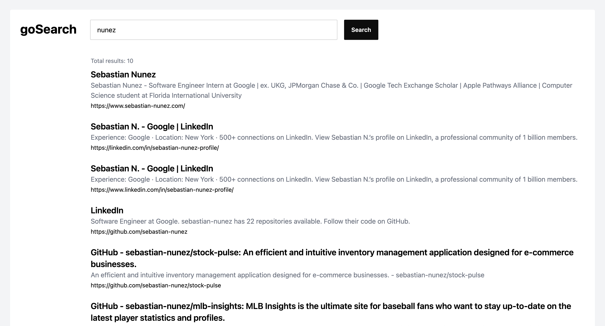
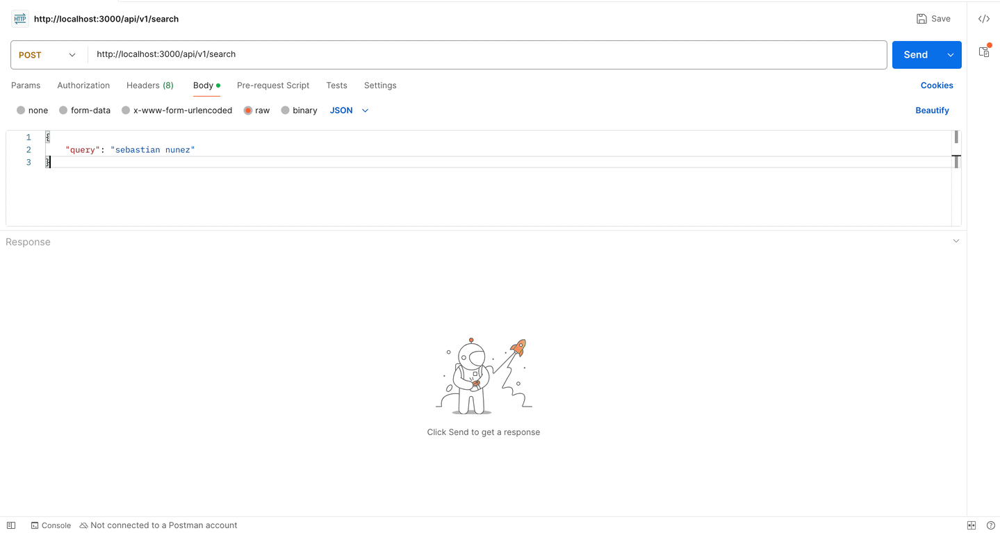

# Golang Search Engine <!-- omit in toc -->

A prototype search engine with a web crawler and full text search through UI and API integrations written in Go.

**Live app:** [https://gosearch.up.railway.app/](https://gosearch.up.railway.app/)



## Table of contents <!-- omit in toc -->

- [Core features (MVP)](#core-features-mvp)
- [Tech stack](#tech-stack)
- [API reference](#api-reference)
  - [`POST /api/v1/search`](#post-apiv1search)
- [Getting started](#getting-started)
  - [Using the production servers](#using-the-production-servers)
  - [Running locally](#running-locally)
    - [Login credentials](#login-credentials)
    - [Initial crawler settings](#initial-crawler-settings)
    - [Seeding URL(s) for the crawler](#seeding-urls-for-the-crawler)
- [Demos](#demos)
  - [UI search](#ui-search)
  - [API request](#api-request)

## Core features (MVP)

- [Web crawler](https://en.wikipedia.org/wiki/Web_crawler)
- Custom [full text search engine](https://www.mongodb.com/resources/basics/full-text-search)
- Cronjobs
- Admin UI to configure the web crawler
- JSON API with JWT auth and [rate limiting](https://www.cloudflare.com/learning/bots/what-is-rate-limiting/#:~:text=Rate%20limiting%20is%20a%20strategy,kinds%20of%20malicious%20bot%20activity.)

## Tech stack

- **Go framework:** [Fiber](https://gofiber.io/)
- **Database:** [PostgreSQL](https://www.postgresql.org/)
- **ORM:** [Gorm](https://gorm.io/)
- **Auth:** JWT tokens using Cookies
- **UI:** [Templ](https://templ.guide/), [HTMX](https://htmx.org/), [DaisyUI](https://daisyui.com/), [TailwindCSS](https://tailwindcss.com/)
- **Load testing:** [Grafana k6](https://grafana.com/docs/k6/latest/)
- **Deployment:** [Docker](https://www.docker.com/), [Air](https://github.com/air-verse/air), [Railway](https://railway.com/)

## API reference

To try out the API, I recommend downloading and using [Postman](https://www.postman.com/downloads/).

- **Base URL (prod):** `https://gosearch.up.railway.app`
- **Base URL (localhost):** `http://localhost:3000`

**Note:** To get the full URL, simply concatenate the Base URL to the API endpoint targeted (e.g. `http://localhost:3000/api/v1/search`)

### `POST /api/v1/search`

Allows users to search for indexed web pages which contain the query terms.

**JSON request body:**

```json
{
  "query": "sebastian nunez"
}
```

**JSON response:**

```jsonc
{
  "results": [
    {
      "id": "b1a34930-b2a3-4f1f-9454-10e926754d55",
      "url": "https://www.sebastian-nunez.com/",
      "indexed": true,
      "success": true,
      "crawlDuration": 89205,
      "statusCode": 200,
      "lastTested": "2024-12-30T01:30:40.975935-05:00",
      "title": "Sebastian Nunez",
      "description": "Sebastian Nunez - Software Engineer Intern at Google | ex. UKG, JPMorgan Chase & Co. | Google Tech Exchange Scholar | Apple Pathways Alliance | Computer Science student at Florida International University",
      "headings": "Hey, I'm Sebastian!",
      "createdAt": "2024-12-30T01:31:34.671422-05:00",
      "updatedAt": "2024-12-30T01:31:34.671422-05:00",
      "deletedAt": null
    }
    // More results...
  ],
  "total": 1
}
```

## Getting started

### Using the production servers

Access the production deployment of the search engine: [https://gosearch.up.railway.app/](https://gosearch.up.railway.app/)

### Running locally

While running the app locally, the main caveats are around seeding the initial data into the database. For now, these are the required actions (SQL queries are provided for convenience):

1. Insert admin credentials to login
2. Insert the initial crawler settings
3. Insert the first URL(s) for the crawler to start exploring

**Here are the installation steps:**

1. Clone the repo: `git clone https://github.com/sebastian-nunez/golang-search-engine`
2. Install [`Go`](https://go.dev/doc/install) 1.23 or greater
3. Install [`Docker Desktop`](https://docs.docker.com/compose/install/)
4. Install [`Air`](https://github.com/air-verse/air) : `go install github.com/air-verse/air@latest`
5. Run docker compose to start the database: `docker compose up`
6. Insert your admin credentials into the database (see the `Login credentials` section below).
7. Create the initial crawler settings (see the `Initial crawler settings` section below).
8. You must manually seed the initial URL(s) for the crawler to begin exploring into the database (see the `Seeding URL(s) for the crawler` section below).
9. Run the app: `air`
10. You can open the crawler settings dashboard: [http://localhost:3000/dashboard](http://localhost:3000/dashboard)
11. Check out the `API reference` section

#### Login credentials

For testing purposes, admin credentials can be inserted into the database. You can use the SQL query below:

```sql
INSERT INTO users (id, email, password, is_admin, created_at, updated_at)
VALUES (uuid_generate_v4(), '<your_email>', '<your_password_hash>', true, NOW(), NOW());
```

**Note:** `password` is your hashed password. So, use [bycrypt](https://bcrypt.online/) to hash your plain-text password (cost factor = 10).

#### Initial crawler settings

The crawler must be configured before starting up the program for the first time. This is the SQL query:

```sql
INSERT INTO crawler_settings (id, urls_per_hour, search_on, add_new_urls, updated_at)
VALUES (1, 25, true, true, NOW());
```

#### Seeding URL(s) for the crawler

With a fresh database, the crawler will not have any websites to visit. So, we must give it a starting point(s).

For now, the only way is through an insert query into PostgreSQL:

```sql
INSERT INTO crawled_pages (id, url)
VALUES (uuid_generate_v4(), '<your_url>');
```

**Quick tip:** sites like `https://news.yahoo.com/` are good initial seeds since they have A LOT of external links to other pages.

## Demos

### UI search


### API request


